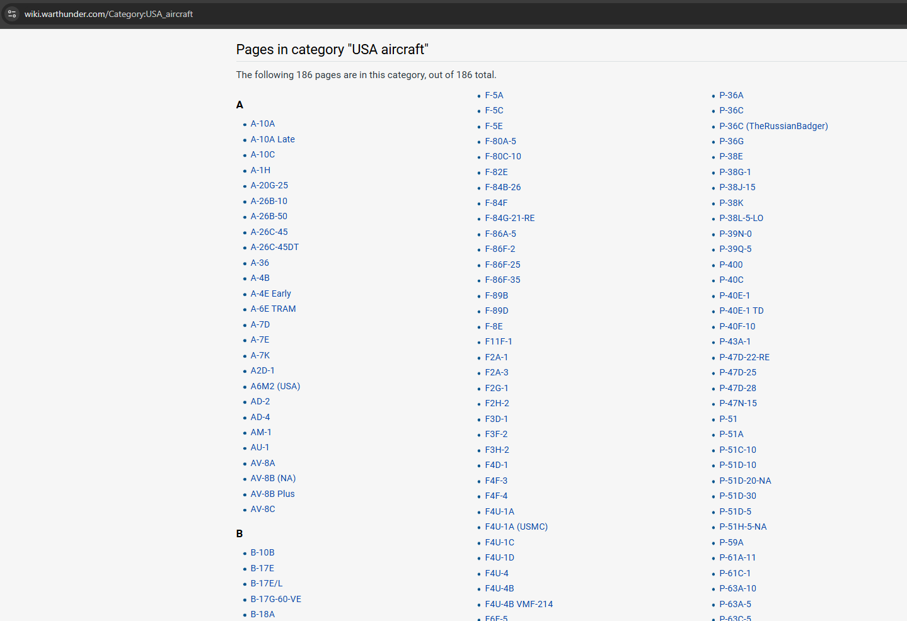
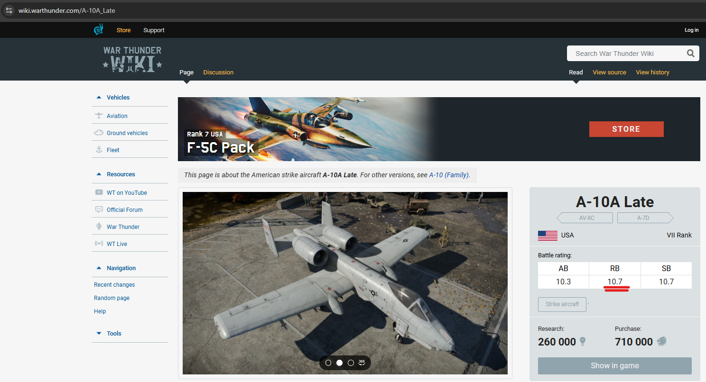
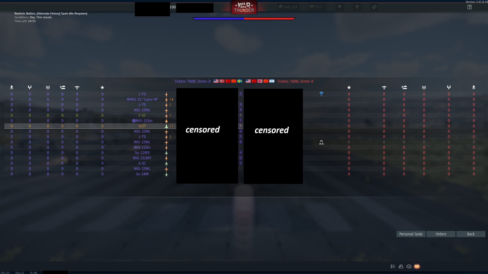
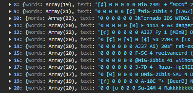
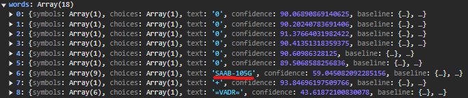
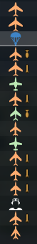
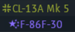

# Air RB Parser READ ME

A brief overview of the problem before describing the application.

- In the MMO game "War Thunder", in the "Air Realistic Battle" mode you are matched with other players based on the rating of your plane. The ratings start at 1.0 and go all the way up to 13.0. The matchmaker can place you against planes around your own plane's rating, up to +-1.0 of your plane's rating.

- This means that you can be potentially facing higher or lower tier planes, making it possible to have a tougher or easier match.

- The only way to tell if you are in an "uptier" or a "downtier" scenario is to deduce it from your own team's lineup, as you are unable to see what the opposite team is fielding.

- As there are over 1160+ vehicles and vehicle variants in the game, it is rather difficult to know them all.

- The purpose of this application is to read a screenshot of your team's lineup, and directly tell the user what kind of game they are in by revealing the rating of each vehicle and thus showing whether it is a "downtier" or an "uptier".

## Table of Contents

- [How it works](#how-it-works)
- [Tools used](#tools-used)

## How it works

### Parsing stage - ./parsers/vehicle_names.ts

First order of business was to create a list of all planes and their specific ratings.
I originally thought to go through game files and find these values directly, however, I was not able to get everything I needed.
Fortunately, the player-ran War Thunder Wiki is an excellent up to date resource.

In order to get a list of each plane names, the following url needed to be accessed and parsed for each country
`https://wiki.warthunder.com/Category:${CATEGORY_NAME}`

Here is an example of what the page looks like for `USA_aircraft`.
There are 10 nations in War Thunder, so this had to be done for each.



In order to parse the data, I used Cheerio https://cheerio.js.org/.

The reason for this choice was that it is a powerful yet relatively simple to use library for static HTML content parsing. And, as the content being loaded and parsed is static it was the perfect choice.

Each plane name was selected and read this was done using HTML selectors such as `#mw-pages > div > div > div:nth-child(${x}) > ul > li:nth-child(${y}) > a`

As some plane names have spaces in them, they needed to be formatted. This was reqired as the name obtained from the list of plane names is directly used in the URL to get specific plane data. Hence it needed to be formatted to match the format style of the URL string.

Example:

- Name obtained from original parse: `A-10A Late`;
- Name required for URL `A-10A_Late`
- Example URL we need to parse: `https://wiki.warthunder.com/A-10A_Late`



This is the page that loads for a specific vehicle. The ONLY item the parser cares about here is the Battle Rating table and specifically the "RB" value highlighted in red.

Selecting this value was achieved by using Cheerio's HTML selectors `$(
      "#mw-content-text > div.mw-parser-output > div.specs_card_main > div.specs_card_main_info > div.general_info_2 > div.general_info_br > table > tbody > tr:nth-child(2) > td:nth-child(2)"
    ).html();`

Now that we had the name and rating, the two items we cared about the most, the data was stored as an array of objects initially in the format of:

```js
const airplane = {
  name: airplaneName,
  rating: airplaneRating,
};
```

We now have the plane names and ratings. However we aren't done processing the data.

- Data needs to be cleaned
  - Near-duplicates need to be fixed - example: `F-86K (France)` and `F-86K (Italy)` are the same plane for the purpose of our application, as their Battle Rating is the same. Hence for all planes with equal rating and identical name before the country brackets, they needed to be consolidated under a single name.
  - Names need to be cleaned - i.e unnescessary brackets removed `F-14A IRIAF (USA)` - there is only one `F-14A IRIAF` in the game, the `(USA)` is redundant
  - Parsing errors causing quotations to appear in name i.e `"A10 "Late""` need to be removed.
- Data needs to be ordered by name
- Data needs to be stored
  - It is not a good idea to run the parsing scripts every time a page is loaded. They can take a couple of minutes to finish and this would slow down the performance of the application considerably.
  - One option is to store them in a database
  - Another option is a CSV file

The next filtering operations outlined above are carried out just before the save operation is initiated.

### Database vs. CSV

#### Upside of Database

- With my own database and backend, I would be able to set up job scheduling to allow for automatic updates whenever a new vehicle is added to the game.

#### Downside of Database

- Query latency when processing an image as each value has to be queried with an external DB.
- The app needs to wait for the backend server to spin up when loaded (more waiting for the user) - assuming using a free serverless provider.

#### Upside of CSV

- Loaded instantly with the page.
- No need for a backend.

#### Downside of CSV

- Parsing operation will need to be run manually whenever a new vehicle is added to the game.
- The repository will need to be re-pushed with the new

In the end I've decided to go the with CSV, using Papa Parse https://www.papaparse.com/ for CSV reading and writing.

---

### OCR stage

For OCR tool, I decided to go with Tesseract.js https://tesseract.projectnaptha.com/ as it is able to run in both Node and in-browser, making it well suited for scoreboard reading.

To begin the OCR process a user needs to upload an image of the scoreboard at the start of the match such as this example:



OCR will process the image top to bottom, left to right. Resulting data will be an array of lines.
In order to identify the specific part of the image we are looking for, my approach was to look for lines that include `"0 0"` as this is the start of the score for each player. The reason why I only chose to go with two 0s instead of `"0 0 0 0 0 0"` as per starting score values of each player was that due to changes in the background (as the scoreboard is transparent), OCR library would sometimes mistakenly identify zeros as other characters.

Example of how the 0s are sometimes identified:



The plane name would then end up being the 6th item in the "word" array



Hence, the application will take the 6th word every time and use it to search for a plane.

But it isn't as simple as that. What if a plane has a space in the name, or multiple spaces?

The solution required a LOT of manual trial and error, however, it all depends on what the next item in the list is. What I mean by that is, if the plane name is one word, the 7th word in the array will be an icon. The OCR will attempt to "read" the icon as text, and it will fail.

Example of common icons:



In order to correctly filter this, a lot of screenshots needed to be processed to create a list of possible OCR results when attempting to read these icons. This is the filter list I created from the data I tried.

```js
"iil",
  "+",
  "A!",
  "Ai)",
  "yl",
  "Al",
  "+",
  "Ai)",
  "4",
  "®",
  "[4",
  "L4",
  "Fy",
  "44",
  "Ai",
  "4:",
  "A",
  "-+",
  "+i",
  "41",
  "Ali",
  `“+`,
  "i",
  "413",
  "4)",
  "“+i",
  "+!",
  "52",
  "Se",
  "k4",
  "$4",
  "(4",
  "?",
  "“-",
  "==0",
  "AL",
  "Eo)",
  "Eo",
  "14",
  "2",
  `"30s"`;
```

This way, if the next item in line is matching the filter list, it is ignored and we do not add a new name to the string. If the item is not present on the filter list, it is assumed to be a correct plane name and it will be added to the search string.

The next challenge in reading the names came from the symbols preceeding plane names:



These would usually be interpreted by the OCR as two symbols - for example `$!`. Hence, every string passed to by the OCR is then broken down, and checked whether the first two characters are both symbols. If they are, that part of the string is taken out.

In fact, there are a number of common and repeated OCR errors that would occur - for example, reading lower case `"i"` as `"I"` or reading `"/"` as `"J"` OR `")"`. However, a simple regex was not sufficient due to the variety of issues with reading names. Some very specific edge cases had to be covered.
I've tried to counter these errors as best as possible by implementing my custom filtering functions within the `src/utils/nameFilter.ts` file.

The purpose of the file is to clean up the parsed names before they are checked against the vehicle name CSV and to improve the overall parsing accuracy.

Lastly, the CSV is loaded via Papa Parse and each value is compared against the CSV, returning the plane name and relevant rating to the user, displaying an ordered table of planes along with the possible plane range from detected values.

## Tools used

### Cheerio - HTML Parsing

https://cheerio.js.org/

### Papa Parse - CSV creation and parsing

https://www.papaparse.com/

### Tesseractjs - OCR

https://tesseract.projectnaptha.com/

### Vite

https://vite.dev/
